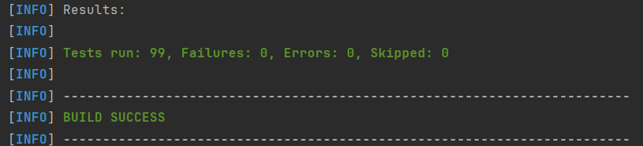
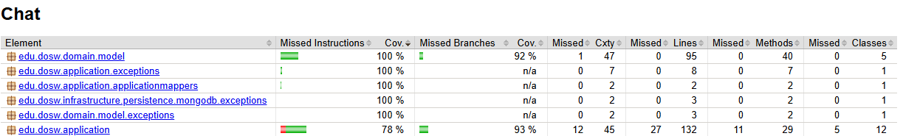
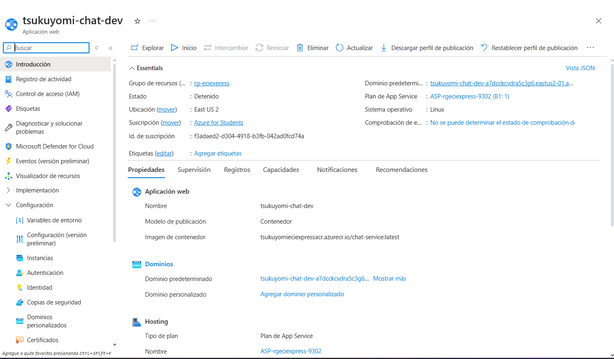
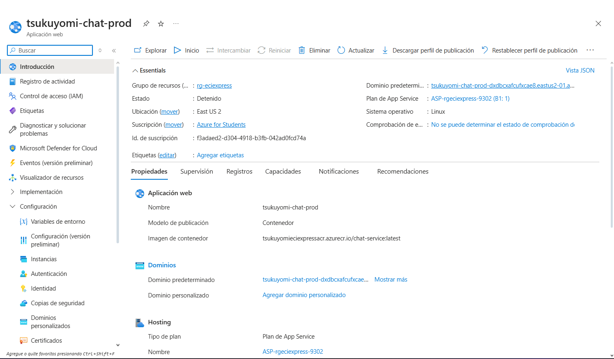

# TSUKUYOMI-Chat-Backend

# 📚 ECIEXPRESS — Sistema de Chat

> <b>Sin filas, sin estres, ECIEXPRESS </b>

--- 

## 📑 Tabla de Contenidos

1. 👤 [Integrantes](#1--integrantes)
2. 🎯 [Objetivo del Proyecto](#2--objetivo-del-proyecto)
3. ⚡ [Funcionalidades principales](#3--funcionalidades-principales)
4. 📋 [Manejo de Estrategia de versionamiento y branches](#4--manejo-de-estrategia-de-versionamiento-y-branches)
    - 4.1 [Convenciones para crear ramas](#41-convenciones-para-crear-ramas)
    - 4.2 [Convenciones para crear commits](#42-convenciones-para-crear-commits)
5. ⚙️ [Tecnologías utilizadas](#5--tecnologias-utilizadas)
6. 🧩 [Funcionalidad](#6--funcionalidad)
7. 📊 [Diagramas](#7--diagramas)
    - 7.1 🟩 [Diagrama de Contexto](#71--diagrama-de-contexto)
    - 7.2 🟦 [Diagrama de Casos de Uso](#72--diagrama-de-casos-de-uso)
    - 7.3 🟨 [Diagrama de Clases](#73--diagrama-de-clases)
    - 7.4 🟥 [Diagrama de Componentes — General](#74--diagrama-de-componentes--general)
    - 7.5 🟨 [Diagrama de Componentes — Específico (Backend)](#75--diagrama-de-componentes--especifico-backend)
    - 7.6 🟩 [Diagrama de Base de Datos (MongoDB)](#76--diagrama-de-base-de-datos-mongodb)
    - 7.7 🛰️ [Diagrama de Despliegue](#77--diagrama-de-despliegue)
8. 🌐 [Endpoints expuestos y su información de entrada y salida](#8--endpoints-expuestos-y-su-informacion-de-entrada-y-salida)
9. ⚠️ [Manejo de Errores](#9--manejo-de-errores)
10. 🧪 [Evidencia de las pruebas y cómo ejecutarlas](#10--evidencia-de-las-pruebas-y-como-ejecutarlas)
11. 🗂️ [Código de la implementación organizado en las respectivas carpetas](#11--codigo-de-la-implementacion-organizado-en-las-respectivas-carpetas)
12. 🚀 [Ejecución del Proyecto](#12--ejecucion-del-proyecto)
13. ☁️ [Evidencia de CI/CD y Despliegue en Azure](#13Per--evidencia-de-cicd-y-despliegue-en-azure)


---

## 1. 👤 Integrantes:

- Sebastian Ortega
- Nikolas Martinez
- Manuel Guarnizo
- Sofia Ariza

## 2. 🎯 Objetivo del Proyecto

En la actualidad, las cafeterias y papelerias dentro de nuestro campus universitario se presentan serias dificultades
operativas durante las horas pico. Estudiantes, docentes y personal administrativo deben enfrentar largas filas y
esperas prolongadas para adquirir sus alimentos o materiales pedidos, lo que genera gran perdida de tiempo, generando
retrasos a clases, desorganizacon y una mala experiencia tanto para los usuarios como para los trabajadores.

El modelo de atención presencial genera mucha agromelación, errores en pedidos y pagos, poca trazabilidad en las ventas,
generando poca eficiencia operativa. Por lo cual se requiere un sistema digital que optimice los procesos de compra, para
reducir los tiempos de espera y mejorando la experiencia de todos.

---

## 3. ⚡ Funcionalidades principales

- Envío y recepción de mensajes en tiempo real
- Sistema de contactos entre los venderores y los usuarios
- Notificaciones de mensajes nuevos
- Búsqueda de conversaciones y mensajes

## 4. 📋 Manejo de Estrategia de versionamiento y branches

### Estrategia de Ramas (Git Flow)

### Ramas y propósito
- Manejaremos GitFlow, el modelo de ramificación para el control de versiones de Git

#### `main`
- **Propósito:** rama **estable** con la versión final (lista para demo/producción).
- **Reglas:**
    - Solo recibe merges desde `release/*` y `hotfix/*`.
    - Cada merge a `main` debe crear un **tag** SemVer (`vX.Y.Z`).
    - Rama **protegida**: PR obligatorio, 1–2 aprobaciones, checks de CI en verde.

#### `develop`
- **Propósito:** integración continua de trabajo; base de nuevas funcionalidades.
- **Reglas:**
    - Recibe merges desde `feature/*` y también desde `release/*` al finalizar un release.
    - Rama **protegida** similar a `main`.

#### `feature/*`
- **Propósito:** desarrollo de una funcionalidad, refactor o spike.
- **Base:** `develop`.
- **Cierre:** se fusiona a `develop` mediante **PR**


#### `release/*`
- **Propósito:** congelar cambios para estabilizar pruebas, textos y versiones previas al deploy.
- **Base:** `develop`.
- **Cierre:** merge a `main` (crear **tag** `vX.Y.Z`) **y** merge de vuelta a `develop`.
- **Ejemplo de nombre:**  
  `release/1.3.0`

#### `hotfix/*`
- **Propósito:** corregir un bug **crítico** detectado en `main`.
- **Base:** `main`.
- **Cierre:** merge a `main` (crear **tag** de **PATCH**) **y** merge a `develop` para mantener paridad.
- **Ejemplos de nombre:**  
  `hotfix/fix-blank-screen`, `hotfix/css-broken-header`


---

### 4.1 Convenciones para **crear ramas**

#### `feature/*`
**Formato:**
```
feature/[nombre-funcionalidad]-ECIExpress_[codigo-jira]
```

**Ejemplos:**
- `feature/readme_ECIExpress-34`

**Reglas de nomenclatura:**
- Usar **kebab-case** (palabras separadas por guiones)
- Máximo 50 caracteres en total
- Descripción clara y específica de la funcionalidad
- Código de Jira obligatorio para trazabilidad

#### `release/*`
**Formato:**
```
release/[version]
```
**Ejemplo:** `release/1.3.0`

#### `hotfix/*`
**Formato:**
```
hotfix/[descripcion-breve-del-fix]
```
**Ejemplos:**
- `hotfix/corregir-pantalla-blanca`
- `hotfix/arreglar-header-responsive`

---

### 4.2 Convenciones para **crear commits**

#### **Formato:**
```
[codigo-jira] [tipo]: [descripción específica de la acción]
```

#### **Tipos de commit:**
- `feat`: Nueva funcionalidad
- `fix`: Corrección de errores
- `docs`: Cambios en documentación
- `style`: Cambios de formato/estilo (espacios, punto y coma, etc.)
- `refactor`: Refactorización de código sin cambios funcionales
- `test`: Agregar o modificar tests
- `chore`: Tareas de mantenimiento, configuración, dependencias

#### **Ejemplos de commits específicos:**
```bash
# ✅ BUENOS EJEMPLOS
git commit -m "26-feat: agregar validación de email en formulario login"
git commit -m "24-fix: corregir error de navegación en header mobile"


# ❌ EVITAR 
git commit -m "23-feat: agregar login"
git commit -m "24-fix: arreglar bug"

```

#### **Reglas para commits específicos:**
1. **Un commit = Una acción específica**: Cada commit debe representar un cambio lógico y completo
2. **Máximo 72 caracteres**: Para que sea legible en todas las herramientas Git
3. **Usar imperativo**: "agregar", "corregir", "actualizar" (no "agregado", "corrigiendo")
4. **Ser descriptivo**: Especificar QUÉ se cambió y DÓNDE
5. **Commits frecuentes**: Mejor muchos commits pequeños que pocos grandes

#### **Beneficios de commits específicos:**
- 🔄 **Rollback preciso**: Poder revertir solo la parte problemática
- 🔍 **Debugging eficiente**: Identificar rápidamente cuándo se introdujo un bug
- 📖 **Historial legible**: Entender la evolución del código
- 🤝 **Colaboración mejorada**: Reviews más fáciles y claras


---


## 5. ⚙️Tecnologías utilizadas

El backend del sistema ECIExpress fue desarrollado con una arquitectura basada en **Spring Boot** y componentes del
ecosistema **Java**, garantizando modularidad, mantenibilidad, seguridad y facilidad de despliegue. A continuación se
detallan las principales tecnologías empleadas en el proyecto:

| **Tecnología / Herramienta** | **Versión / Framework** | **Uso principal en el proyecto** |
|------------------------------|--------------------------|----------------------------------|
| **Java OpenJDK** | 17 | Lenguaje de programación base del backend, orientado a objetos y multiplataforma. |
| **Spring Boot** | 3.x | Framework principal para la creación del API REST, manejo de dependencias e inyección de componentes. |
| **Spring Web** | — | Implementación del modelo MVC y exposición de endpoints REST. |
| **Spring Security** | — | Configuración de autenticación y autorización de usuarios mediante roles y validación de credenciales. |
| **Spring Data MongoDB** | — | Integración con la base de datos NoSQL MongoDB mediante el patrón Repository. |
| **MongoDB Atlas** | 6.x | Base de datos NoSQL en la nube utilizada para almacenar las entidades del sistema. |
| **Apache Maven** | 3.9.x | Gestión de dependencias, empaquetado del proyecto y automatización de builds. |
| **Lombok** | — | Reducción de código repetitivo con anotaciones como `@Getter`, `@Setter`, `@Builder` y `@AllArgsConstructor`. |
| **JUnit 5** | — | Framework para pruebas unitarias que garantiza el correcto funcionamiento de los servicios. |
| **Mockito** | — | Simulación de dependencias para pruebas unitarias sin requerir acceso a la base de datos real. |
| **JaCoCo** | — | Generación de reportes de cobertura de código para evaluar la efectividad de las pruebas. |
| **SonarQube** | — | Análisis estático del código fuente y control de calidad para detectar vulnerabilidades y malas prácticas. |
| **Swagger (OpenAPI 3)** | — | Generación automática de documentación y prueba interactiva de los endpoints REST. |
| **Postman** | — | Entorno de pruebas de la API, utilizado para validar respuestas en formato JSON con los métodos `POST`, `GET`, `PATCH` y `DELETE`. |
| **Docker** | — | Contenerización del servicio para garantizar despliegues consistentes en distintos entornos. |
| **Azure App Service** | — | Entorno de ejecución en la nube para el despliegue automático del backend. |
| **Azure DevOps** | — | Plataforma para la gestión ágil del proyecto, seguimiento de tareas y control de versiones. |
| **GitHub Actions** | — | Configuración de pipelines de integración y despliegue continuo (CI/CD). |
| **SSL / HTTPS** | — | Implementación de certificados digitales para asegurar la comunicación entre cliente y servidor. |

> 🧠 Estas tecnologías fueron seleccionadas para asegurar **escalabilidad**, **modularidad**, **seguridad**, **trazabilidad** y **mantenibilidad** del sistema, aplicando buenas prácticas de ingeniería de software y estándares de desarrollo moderno.


## 6. 🧩 Funcionalidad


## 7. 📊 Diagramas


## 8. 🌐 Endpoints expuestos y su información de entrada y salida


## 9. ⚠️ Manejo de Errores

El backend de **ECIExpress** implementa un **mecanismo centralizado de manejo de errores** que garantiza uniformidad, claridad y seguridad en todas las respuestas enviadas al cliente cuando ocurre un fallo.

Este sistema permite mantener una comunicación clara entre el backend y el frontend, asegurando que los mensajes de error sean legibles, útiles y coherentes, sin exponer información sensible del servidor.

---

### 🧠 Estrategia general de manejo de errores

El sistema utiliza una **clase global** que intercepta todas las excepciones lanzadas desde los controladores REST.  
A través de la anotación `@ControllerAdvice`, se centraliza el manejo de errores, evitando el uso repetitivo de bloques `try-catch` en cada endpoint.

Cada error se transforma en una respuesta **JSON estandarizada**, que mantiene un formato uniforme para todos los tipos de fallos.

**📋 Estructura del mensaje de error:**

```json
{
  "timestamp": "2025-11-10T10:30:00Z",
  "status": 404,
  "error": "Not Found",
  "message": "Usuario no encontrado.",
  "path": "/api/credentials/{email}"
}
```

---

### ⚙️ Global Exception Handler

El **Global Exception Handler** es una clase con la anotación `@ControllerAdvice` que captura y maneja todas las excepciones del sistema.  
Utiliza métodos con `@ExceptionHandler` para procesar errores específicos y devolver una respuesta personalizada acorde al tipo de excepción.

**✨ Características principales:**

- ✅ **Centraliza** la captura de excepciones desde todos los controladores
- ✅ **Retorna mensajes JSON consistentes** con el mismo formato estructurado
- ✅ **Asigna códigos HTTP** según la naturaleza del error (400, 404, 409, 500, etc.)
- ✅ **Define mensajes descriptivos** que ayudan tanto al desarrollador como al usuario
- ✅ **Mantiene la aplicación limpia**, eliminando bloques try-catch redundantes
- ✅ **Mejora la trazabilidad** y facilita la depuración en los entornos de prueba y producción

**🔄 Ejemplo conceptual de funcionamiento:**

Cuando se lanza una excepción del tipo `EntityNotFoundException`, el handler la intercepta y genera automáticamente una respuesta como:

```json
{
  "status": 404,
  "error": "Not Found",
  "message": "Usuario no encontrado.",
  "path": "/api/credentials/{email}"
}
```

---

### 🧩 Validaciones en DTOs

Además del manejo global de errores, el sistema utiliza **validaciones automáticas** sobre los DTOs (Data Transfer Objects) para garantizar que los datos que llegan al servidor cumplan con las reglas de negocio antes de ejecutar cualquier lógica.

Estas validaciones se implementan mediante las anotaciones de **Javax Validation** y **Hibernate Validator**, como `@NotBlank`, `@NotNull`, `@Email`, `@Min`, `@Max`, entre otras.

**📝 Ejemplo de DTO con validaciones:**

```java

```

Si alguno de los campos no cumple las validaciones, se lanza automáticamente una excepción del tipo `MethodArgumentNotValidException`.  
Esta es capturada por el **Global Exception Handler**, que devuelve una respuesta JSON estandarizada con el detalle del campo inválido.

**⚠️ Ejemplo de respuesta ante error de validación:**

```json
{
  "status": 400,
  "error": "Bad Request",
  "message": "El campo 'email' debe tener un formato válido."
}
```

> 💡 Gracias a este mecanismo, se asegura que las peticiones erróneas sean detectadas desde el inicio, reduciendo fallos en capas más profundas como servicios o repositorios.

---

### 📊 Tipos de errores manejados

La siguiente tabla resume los principales tipos de excepciones manejadas en el sistema, junto con su respectivo código HTTP y un ejemplo de mensaje retornado:

| **Excepción** | **Código HTTP** | **Descripción del error** | **Ejemplo de mensaje** |
|---------------|-----------------|---------------------------|------------------------|
| `IllegalArgumentException` | `400 Bad Request` | Parámetros inválidos o peticiones mal estructuradas | *"El parámetro no puede ser nulo."* |
| `MethodArgumentNotValidException` | `400 Bad Request` | Error de validación en un DTO o parámetro de entrada | *"El campo no cumple con el formato requerido."* |
| `ModelLayerExceptions` | `400 Bad Request` | Errores de validación en el modelo de dominio | *"Cannot have empty message"* |
| `ApplicationLayerExceptions` | | **Agrupa múltiples errores de lógica de negocio:** | |
| └─ `conversationNotFound()` | `404 Not Found` | La conversación solicitada no existe | *"Conversation not found"* |
| └─ `conversationNotFound(id)` | `404 Not Found` | Conversación específica no encontrada | *"Conversation not found: {conversationId}"* |
| └─ `userNotFound()` | `404 Not Found` | Usuario no encontrado en el sistema | *"Conversation not found"* *(nota: revisar mensaje)* |
| └─ `userNotAuthorized()` | `403 Forbidden` | El usuario no tiene permisos para realizar la acción | *"User not authorized"* |
| └─ `notEnoughUsers()` | `400 Bad Request` | Intento de crear conversación sin usuarios suficientes | *"There's needed 2 users at least to make a conversation"* |
| └─ `cannotAddContact()` | `400 Bad Request` | Intento de agregar contacto con usuarios inexistentes | *"Both users must exist to add as contacts"* |
| `MongoPersistenceExceptions` | `404 Not Found` | Errores relacionados con la capa de persistencia MongoDB | *"Conversation not found on repository"* |
| `ConversationExceptions` | `401 Unauthorized` | Errores específicos del módulo de conversaciones | *"Autenticacion del usuario fallida"* |
| `DuplicateKeyException` | `409 Conflict` | Intento de crear un registro duplicado en MongoDB | *"El registro ya existe en la base de datos."* |
| `Exception` | `500 Internal Server Error` | Error interno no controlado del servidor | *"Error inesperado del servidor."* |

---

### ✅ Beneficios del manejo centralizado

| **Beneficio** | **Descripción** |
|---------------|-----------------|
| 🎯 **Uniformidad** | Todas las respuestas de error tienen el mismo formato JSON |
| 🔧 **Mantenibilidad** | Agregar nuevas excepciones no requiere modificar cada controlador |
| 🔒 **Seguridad** | Oculta los detalles internos del servidor y evita exponer trazas del sistema |
| 📍 **Trazabilidad** | Cada error incluye información contextual (ruta y hora exacta) |
| 🤝 **Integración fluida** | Facilita la comunicación con el frontend y herramientas como Postman o Swagger |

---

> Gracias a este enfoque, el backend de ECIExpress logra un manejo de errores **robusto**, **escalable** y **seguro**, garantizando una experiencia de usuario más confiable y profesional.

---


---

## 10. 🧪 Evidencia de las pruebas y cómo ejecutarlas

El backend de **ECIExpress** implementa una **estrategia integral de pruebas** que garantiza la calidad, funcionalidad y confiabilidad del código mediante pruebas unitarias y de integración.

---

### 🎯 Tipos de pruebas implementadas

| **Tipo de prueba** | **Descripción** | **Herramientas utilizadas** |
|-------------------|-----------------|----------------------------|
| **Pruebas unitarias** | Validan el funcionamiento aislado de cada componente (servicios, repositorios, utilidades) | JUnit 5, Mockito |
| **Cobertura de código** | Mide el porcentaje de código cubierto por las pruebas | JaCoCo |

---

### 🚀 Cómo ejecutar las pruebas

#### **1️⃣ Ejecutar todas las pruebas**

Desde la raíz del proyecto, ejecuta:

```bash
mvn clean test
```

Este comando:
- Limpia compilaciones anteriores (`clean`)
- Ejecuta todas las pruebas unitarias y de integración (`test`)
- Muestra el resultado en la consola

#### **2️⃣ Generar reporte de cobertura con JaCoCo**

```bash
mvn clean test jacoco:report
```

El reporte HTML se generará en:
```
target/site/jacoco/index.html
```

Abre este archivo en tu navegador para ver:
- Cobertura por paquete
- Cobertura por clase
- Líneas cubiertas vs. no cubiertas

#### **3️⃣ Ejecutar pruebas desde IntelliJ IDEA**

1. Click derecho sobre la carpeta `src/test/java`
2. Selecciona **"Run 'Tests in...'**
3. Ver resultados en el panel inferior

#### **4️⃣ Ejecutar una prueba específica**

```bash
mvn test -Dtest=ConversationServiceTest
```

---

### 🧪 Ejemplo de prueba unitaria

```java
@ExtendWith(MockitoExtension.class)
class SendMessageUseCaseImplTest {

    @Mock
    private ConversationRepository conversationRepository;

    @Mock
    private ConversationMessageApplicationMapper conversationMessageApplicationMapper;

    @Mock
    private ConversationMessageRepository conversationMessageRepository;

    @InjectMocks
    private SendMessageUseCaseImpl sendMessageUseCase;

    private String conversationId;
    private String authorId;
    private Conversation conversation;
    private SendConversationMessageCommand command;

    @BeforeEach
    void setUp() {
        conversationId = "conv-123";
        authorId = "user-1";

        List<String> userIds = Arrays.asList(authorId, "user-2");
        conversation = new Conversation(userIds, "order-1");

        command = new SendConversationMessageCommand(conversationId, "Hola mundo", authorId);
    }

    @Test
    void execute_shouldSendMessage_whenConversationExistsAndUserIsAuthorized() {
        // Arrange
        ConversationMessage message = new Regular(conversationId, "Hola mundo", authorId);

        when(conversationRepository.findConversationById(conversationId)).thenReturn(conversation);
        when(conversationMessageApplicationMapper.toDomain(command)).thenReturn(message);

        // Act
        ConversationMessage result = sendMessageUseCase.execute(command);

        // Assert
        assertThat(result).isNotNull();
        verify(conversationRepository).updateConversation(conversation);
        verify(conversationMessageRepository).saveConversationMessage(message);
    }
}
```

---

### 🖼️ Evidencias de ejecución

1. **Consola mostrando pruebas ejecutándose exitosamente**
    

2. **Reporte JaCoCo con cobertura de código**
    

---

### ✅ Criterios de aceptación de pruebas

Para considerar el sistema correctamente probado, se debe cumplir:

- ✅ **Cobertura mínima del 80%** en servicios y lógica de negocio
- ✅ **Todas las pruebas en estado PASSED** (sin fallos)
- ✅ **Cero errores de compilación** en el código de pruebas
- ✅ **Pruebas de casos felices y casos de error** implementadas

---

### 🔄 Integración con CI/CD

Las pruebas se ejecutan automáticamente en cada **push** o **pull request** mediante GitHub Actions:

```yaml
  - name: Build + Test + Coverage
    run: mvn -B clean verify
```

Esto garantiza que ningún cambio roto llegue a producción.

---

## 11. 🗂️ Código de la implementación organizado en las respectivas carpetas

El proyecto **Tsukuyomi Chat Backend** sigue una **arquitectura hexagonal (puertos y adaptadores)** que separa las responsabilidades en capas bien definidas, promoviendo la escalabilidad, testabilidad y mantenibilidad del código.

---

### 📂 Estructura general del proyecto (Scaffolding)

```
TSUKUYOMI-Chat-Backend/
│
├── 📁 src/
│   ├── 📁 main/
│   │   ├── 📁 java/edu/dosw/
│   │   │   ├── 📄 ChatApplication.java          # Clase principal de Spring Boot
│   │   │   ├── 📁 domain/                       # 🟢 Capa de Dominio
│   │   │   │   ├── 📁 model/                    # Entidades del negocio
│   │   │   │   └── 📁 ports/                    # Interfaces (contratos)
│   │   │   │       ├── 📁 inbound/              # Casos de uso
│   │   │   │       └── 📁 outbound/             # Repositorios
│   │   │   │
│   │   │   ├── 📁 application/                  # 🔵 Capa de Aplicación
│   │   │   │   ├── *UseCaseImpl.java            # Implementación de casos de uso
│   │   │   │   ├── 📁 applicationmappers/       # Mappers internos
│   │   │   │   └── 📁 exceptions/               # Excepciones de aplicación
│   │   │   │
│   │   │   └── 📁 infrastructure/               # 🟠 Capa de Infraestructura
│   │   │       ├── 📁 adapters/in/              # Controladores REST/WebSocket
│   │   │       │   ├── 📁 dtos/                 # DTOs de entrada/salida
│   │   │       │   ├── 📁 mappers/              # Mappers Web ↔ Dominio
│   │   │       │   └── 📁 exceptions/           # Manejo global de excepciones
│   │   │       │
│   │   │       ├── 📁 persistence/              # Adaptadores de MongoDB
│   │   │       │   ├── 📁 documents/            # Documentos MongoDB
│   │   │       │   ├── 📁 mappers/              # Mappers BD ↔ Dominio
│   │   │       │   ├── 📁 repositories/         # Repositorios Spring Data
│   │   │       │   └── 📁 exceptions/           # Excepciones de persistencia
│   │   │       │
│   │   │       ├── 📁 configs/                  # Configuraciones de Spring
│   │   │       └── 📁 events/                   # Eventos y notificaciones
│   │   │
│   │   └── 📁 resources/
│   │       └── application.properties           # Configuración de la aplicación
│   │
│   └── 📁 test/                                 # 🧪 Pruebas
│       └── 📁 java/edu/dosw/
│           ├── 📁 application/                  # Tests de casos de uso
│           ├── 📁 domain/                       # Tests del modelo
│           └── 📁 infrastructure/               # Tests de adaptadores
│
└── 📁 target/                                   # Artefactos compilados (Maven)
    └── 📁 site/jacoco/                          # Reportes de cobertura
```

---

### 🏛️ Arquitectura Hexagonal

El proyecto implementa **Arquitectura Hexagonal (Ports & Adapters)** con tres capas principales:

| **Capa** | **Responsabilidad** | **Dependencias** |
|----------|---------------------|------------------|
| **🟢 Domain** | Lógica de negocio pura, entidades y contratos (ports) | Ninguna (independiente) |
| **🔵 Application** | Orquestación de casos de uso y reglas de negocio | Solo depende de Domain |
| **🟠 Infrastructure** | Adaptadores externos (REST, MongoDB, WebSocket, configs) | Depende de Domain y Application |

**Flujo de dependencias:** `Infrastructure → Application → Domain`

---

### 🎯 Principios de diseño aplicados

✅ **Separación de responsabilidades** - Cada capa tiene un propósito único y bien definido  
✅ **Inversión de dependencias** - Las capas externas dependen de las internas, no al revés  
✅ **Independencia del framework** - La lógica de negocio no depende de Spring o MongoDB  
✅ **Testabilidad** - Fácil crear pruebas unitarias mockeando dependencias  
✅ **Mantenibilidad** - Cambios en una capa no afectan a las demás  

---

## 12. 🚀 Ejecución del Proyecto


## 13. ☁️ Evidencia de CI/CD y Despliegue en Azure

El proyecto implementa un **pipeline completo de CI/CD** utilizando **GitHub Actions** para automatizar el proceso de integración continua, pruebas, análisis de calidad y despliegue en **Azure Cloud**.

---

### 🔄 Pipeline de CI/CD

El proyecto cuenta con **3 workflows automatizados** que se ejecutan en diferentes momentos del ciclo de desarrollo:

| **Workflow** | **Archivo** | **Trigger** | **Propósito** |
|-------------|-------------|-------------|---------------|
| **CI - Tests & Quality** | `ci.yml` | Push/PR a `develop`, `main`, `feature/**` | Ejecutar pruebas, generar cobertura y análisis de SonarQube |
| **CD - Deploy DEV** | `cd_dev.yml` | Push a `develop`, `feature/**` | Desplegar automáticamente al ambiente de desarrollo |
| **CD - Deploy PROD** | `cd_prod.yml` | Push a `main` | Desplegar automáticamente al ambiente de producción |

---

### 🧪 CI - Integración Continua (ci.yml)

Este workflow se ejecuta en cada **push** o **pull request** para garantizar la calidad del código antes de integrar cambios.

**Pasos del pipeline CI:**

1. **Checkout del código** - Descarga el código fuente del repositorio
2. **Setup JDK 17** - Configura el entorno de Java con Temurin
3. **Cache de dependencias Maven** - Optimiza tiempos de build reutilizando dependencias
4. **Levantar MongoDB (servicio)** - Inicia una instancia de MongoDB para las pruebas
5. **Build + Test + Coverage** - Ejecuta `mvn clean verify` para compilar, probar y generar cobertura
6. **Análisis SonarQube** - Envía métricas de calidad de código a SonarCloud/SonarQube
7. **Publicar reporte JaCoCo** - Sube el reporte HTML de cobertura como artefacto

**Fragmento del workflow CI:**

```yaml
- name: Build + Test + Coverage
  run: mvn -B clean verify
  env:
    SPRING_PROFILES_ACTIVE: test
    MONGODB_URI: mongodb://localhost:27017/Chat-db

- name: SonarQube Analysis
  run: mvn -B sonar:sonar
  env:
    SONAR_TOKEN: ${{ secrets.SONAR_TOKEN }}
```

**Beneficios:**
- ✅ Detección temprana de errores antes de fusionar cambios
- ✅ Garantiza que todas las pruebas pasen antes del despliegue
- ✅ Métricas de calidad de código (code smells, bugs, vulnerabilidades)
- ✅ Reporte de cobertura de código disponible en cada build

---

### 🚀 CD - Despliegue Continuo (cd_dev.yml / cd_prod.yml)

Estos workflows automatizan el **despliegue** del backend en **Azure Web App** utilizando **Docker** y **Azure Container Registry (ACR)**.

**Pasos del pipeline CD:**

1. **Checkout del código** - Descarga el código fuente
2. **Login a Azure Container Registry** - Autenticación con credenciales almacenadas en secrets
3. **Build de la imagen Docker** - Construye la imagen con etiquetas `latest` y hash del commit
4. **Push de la imagen a ACR** - Sube la imagen al registro de contenedores de Azure
5. **Deploy a Azure Web App** - Despliega el contenedor en el App Service correspondiente (DEV o PROD)

**Fragmento del workflow CD:**

```yaml
- name: Build Docker image
  run: |
    IMAGE_NAME="${{ secrets.ACR_LOGIN_SERVER }}/chat-service"
    GIT_TAG=${GITHUB_SHA::7}
    docker build -t "$IMAGE_NAME:latest" -t "$IMAGE_NAME:$GIT_TAG" .

- name: Deploy container to Azure Web App
  uses: azure/webapps-deploy@v3
  with:
    app-name: ${{ secrets.AZURE_WEBAPP_NAME_PROD }}
    publish-profile: ${{ secrets.AZURE_WEBAPP_PUBLISH_PROFILE_PROD }}
    images: ${{ secrets.ACR_LOGIN_SERVER }}/chat-service:latest
```

**Estrategia de despliegue:**

- **Desarrollo (`develop`)** → Deploy automático a **Azure Web App (DEV)**
- **Producción (`main`)** → Deploy automático a **Azure Web App (PROD)**
- **Feature branches** → Deploy a DEV para pruebas antes de fusionar

---

### ☁️ Infraestructura en Azure

El backend está desplegado en la nube de **Microsoft Azure** utilizando los siguientes servicios:

| **Servicio de Azure** | **Propósito** | **Configuración** |
|-----------------------|---------------|-------------------|
| **Azure Web App (App Service)** | Hosting del backend Spring Boot en contenedor Docker | Linux, Docker Container, escalable |
| **Azure Container Registry (ACR)** | Almacenamiento privado de imágenes Docker | Registro privado, integrado con Web App |
| **MongoDB Atlas** | Base de datos NoSQL en la nube | Cluster compartido, conexión segura |
| **Application Insights** (opcional) | Monitoreo y telemetría de la aplicación | Logs, métricas, trazas distribuidas |

**Arquitectura de despliegue:**

```
GitHub Repository (push)
    ↓
GitHub Actions (CI/CD Pipeline)
    ↓
Azure Container Registry (ACR)
    ↓
Azure Web App (App Service)
    ↓
MongoDB Atlas (Database)
```

---

### 🔐 Secrets y Variables de Entorno

Los siguientes **secrets** están configurados en GitHub para el pipeline CI/CD:

| **Secret** | **Descripción** |
|-----------|-----------------|
| `ACR_LOGIN_SERVER` | URL del Azure Container Registry (ej: `myregistry.azurecr.io`) |
| `ACR_USERNAME` | Usuario de autenticación del ACR |
| `ACR_PASSWORD` | Contraseña del ACR |
| `AZURE_WEBAPP_NAME_DEV` | Nombre del App Service de desarrollo |
| `AZURE_WEBAPP_NAME_PROD` | Nombre del App Service de producción |
| `AZURE_WEBAPP_PUBLISH_PROFILE_DEV` | Perfil de publicación para ambiente DEV |
| `AZURE_WEBAPP_PUBLISH_PROFILE_PROD` | Perfil de publicación para ambiente PROD |
| `SONAR_TOKEN` | Token de autenticación para SonarQube/SonarCloud |

---

### 📊 Evidencias

**Azure Web App - Aplicación desplegada**
   
   


---

### ✅ Ventajas del pipeline implementado

- 🚀 **Despliegue automático** - Cada commit a `main` se despliega automáticamente a producción
- 🧪 **Calidad garantizada** - Las pruebas y análisis se ejecutan antes de cada despliegue
- 🔄 **Rollback rápido** - Versionado de imágenes Docker con hash del commit permite revertir cambios
- 📦 **Infraestructura como código** - Todo el pipeline está versionado en Git
- 🔐 **Seguridad** - Credenciales almacenadas de forma segura en GitHub Secrets
- 📊 **Trazabilidad** - Historial completo de despliegues y pruebas en GitHub Actions

---

## 14. 🤝 Contribuciones

El desarrollo del backend de ECIEXPRESS se realizó aplicando la **metodología ágil Scrum**, promoviendo la colaboración, la mejora continua y la entrega incremental de valor.  
Durante el proceso, el equipo Tsukuyomi trabajó en **sprints semanales**, realizando **revisiones de avance**, **dailies** y **retrospectivas**, lo que permitió mantener una comunicación fluida y adaptarse a los cambios de requisitos en tiempo real.

Cada miembro del equipo asumió un rol dentro del marco de Scrum:

| **Rol Scrum** | **Responsabilidad principal** |
|----------------|-------------------------------|
| **Product Owner** | Definir y priorizar las historias de usuario en el backlog del producto. |
| **Scrum Master** | Asegurar la aplicación de la metodología y eliminar impedimentos. |
| **Developers** | Diseñar, implementar, probar y documentar las funcionalidades. |

**Artefactos y eventos Scrum utilizados:**
- 📋 **Product Backlog:** listado de funcionalidades priorizadas y mantenidas en Jira/GitHub Projects.
- 🧩 **Sprint Backlog:** tareas seleccionadas por sprint según la capacidad del equipo.
- ⚙️ **Daily Scrum:** reuniones cortas de sincronización para identificar bloqueos y avances.
- 📦 **Sprint Review:** revisión de resultados y demostración del incremento funcional.
- 🔄 **Sprint Retrospective:** análisis de mejoras en la dinámica y la comunicación del equipo.

> 💡 Gracias al uso de Scrum, el desarrollo de Tsukuyomi se mantuvo **organizado, transparente y enfocado en la entrega continua de valor**, aplicando principios de autoorganización y aprendizaje colaborativo.

---
### Desarrollado por el equipo Tsukuyomi – DOSW 2025-2

> 💡 **ECIEXPRESS** es un proyecto académico, pero su arquitectura y calidad están pensadas para ser escalables y adaptables a escenarios reales en instituciones educativas.

---


